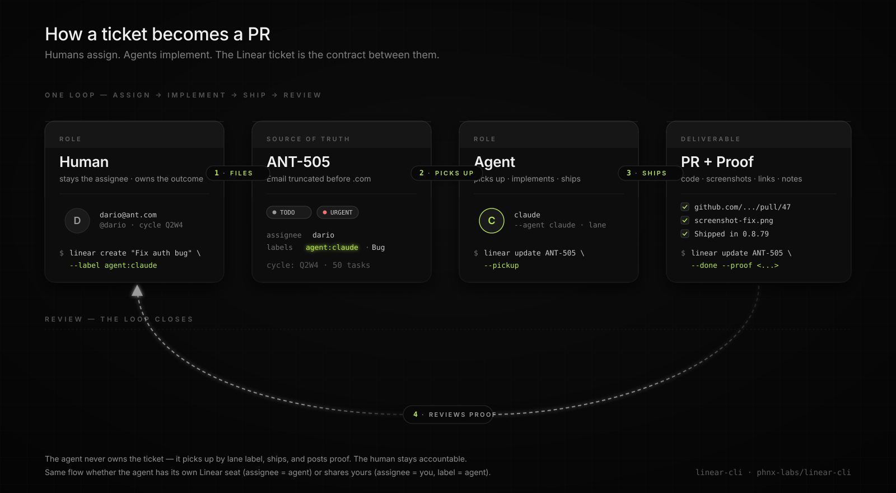
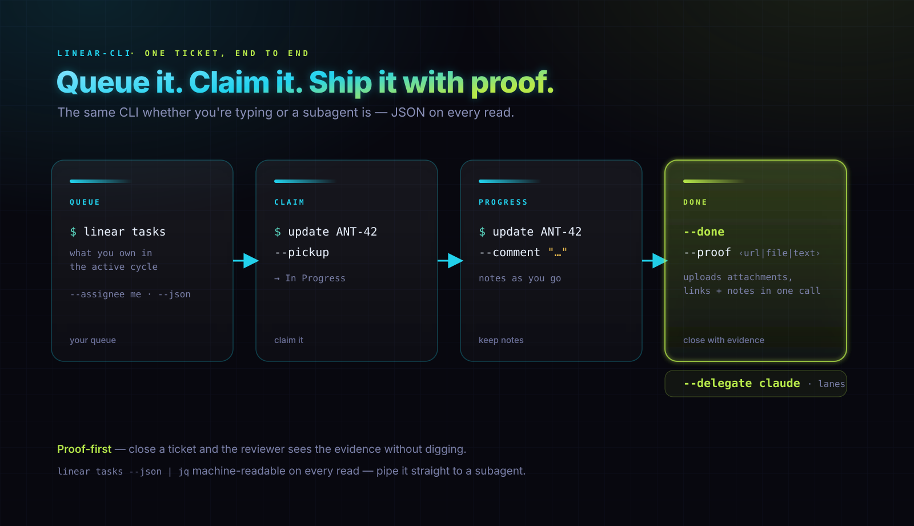
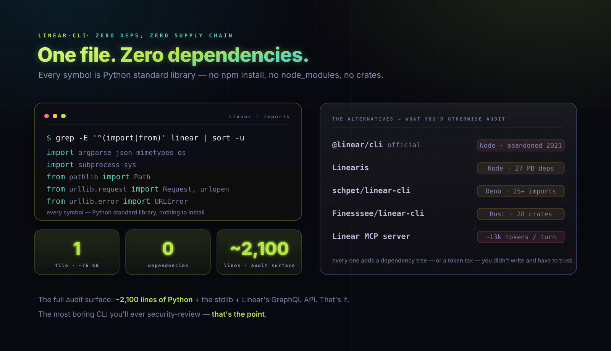
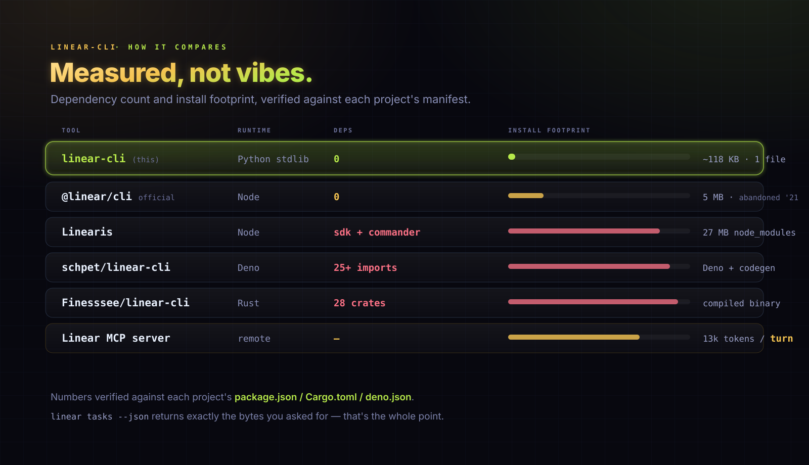

# linear-cli

> Linear for you and your agents. Same queue, same CLI.

[](LICENSE)
[](https://www.python.org/downloads/)
[](#zero-dependencies-literally)
[](#zero-supply-chain-attack-surface)
[](./linear)
[](#why-the-mcp-server-isnt-always-the-answer)

Linear for human-owned work and agent-executed handoff. Keep the human as assignee, delegate the issue to an agent with `--delegate`, and require proof before `--done` closes the loop.

Use the same shell contract whether you're typing or a subagent is: query the queue, delegate the work, ship progress notes, and close only with evidence. Single-file Python (stdlib only) keeps install and audit overhead low, but the moat is the delegation workflow.

<p align="center">
  
</p>

<p align="center">
  <a href="https://github.com/phnx-labs/linear-cli/releases/download/v0.1.0/LinearDemo.mp4">
    
  </a>
  <br />
  <sub><a href="https://github.com/phnx-labs/linear-cli/releases/download/v0.1.0/LinearDemo.mp4">Watch with audio (MP4, 1.4 MB)</a></sub>
</p>

## Install

```bash
curl -sSL https://raw.githubusercontent.com/phnx-labs/linear-cli/main/install.sh | bash
```

Or manually:

```bash
curl -o /usr/local/bin/linear https://raw.githubusercontent.com/phnx-labs/linear-cli/main/linear
chmod +x /usr/local/bin/linear
```

## Setup

Create a Linear API key with Full access at [linear.app/settings/account/security](https://linear.app/settings/account/security), then:

```bash
linear setup --api-key lin_api_... --agent claude
```

Config is written to `~/.linear-cli/config.json`. If you already have `~/.agents/linear.json` from an earlier setup, linear-cli auto-migrates it on first run.

> **Security:** treat the API key like a password. **Do not paste it into chat with an LLM in plaintext.** Pass it from your shell env (`linear setup --api-key "$LINEAR_API_KEY"`), or let linear-cli read it from the macOS Keychain. Resolution order is: config file → `LINEAR_API_KEY` env → Keychain service `linear-api-key`.

### Fleet setup for agents

For a shared agent fleet, mint the Full-access key once with `agents browser` so the browser session drives `linear.app/settings/account/security` instead of exposing the key in chat. Store it in `agents secrets` / the OS keychain, then let each session run with `LINEAR_API_KEY` populated from that secret.

No code change is required for this path: linear-cli already resolves credentials from its config file, then `LINEAR_API_KEY`, then the macOS Keychain service `linear-api-key`.

## Usage

<p align="center">
   --pickup (claim, In Progress) -> --comment (progress) -> --done --proof (close with evidence). JSON on every read." width="100%" />
</p>


```bash
linear tasks                         # your queue in the active cycle
linear tasks --board                 # whole team board
linear tasks ANT-42                   # detail view
linear tasks --query "auth refresh"  # search title + description
linear tasks --cycle all             # whole team: every cycle + backlog
linear tasks --cycle none            # the backlog (issues in no cycle)
linear tasks --cycle "Q2W11"         # a specific cycle by name, number, or id
linear tasks --since 2026-06-01      # only issues created on/after a date
linear tasks --assignee me           # by assignee: me | none | someone@x.com
linear tasks --project "Rush App"    # scope to one project (name or UUID)
linear tasks --milestone "v1.0"      # scope to one milestone (the whole deliverable)
linear tasks --project "Rush App" --by-milestone  # group by milestone; unmatched fall in "No milestone"
linear tasks --json | jq             # machine-readable

linear update ANT-42 --pickup         # claim (In Progress)
linear update ANT-42 --comment "..."  # progress note
linear update ANT-42 --done --proof https://pr/123 --proof "deployed"
linear update ANT-42 --priority urgent --assign bisma      # human by name or email
linear update ANT-42 --title "Renamed"  --description "Rewritten body"
linear update ANT-42 --project "Foo" --milestone "v1.0"
linear update ANT-42 --blocked-by ANT-7 --blocks ANT-9   # relations
linear update ANT-42 --delegate claude                   # hand to an agent (delegate)
linear update ANT-42 --delegate none                     # clear the delegate
linear update ANT-1 ANT-2 ANT-3 --cycle none             # bulk: many ids at once
linear tasks --cycle all --json | jq -r '.issues[].identifier' \
  | linear update --stdin --label triage                 # bulk via stdin (xargs-style)

linear create "Fix auth bug" --label security --priority high
linear create --description "Paragraph dump — title is derived from this."
linear create "Sub-task" --parent ANT-42     # nested; prints a tip nudging a flat issue
linear create "Roadmap item" --project "Phoenix" --milestone "v1.0"
linear create "Ship it" --delegate droid    # create + hand to an agent
linear create --from-file plan.jsonl  # bulk: one JSON object per line

linear projects                       # list projects + progress + issue count
linear projects "Phoenix"             # detail view: milestones with per-milestone % done
linear projects create --name "Phoenix" --lead you@co.com --target 2026-09-30
linear projects archive "Old Project" # remove a project (moves to trash)
linear milestones list "Phoenix"      # milestones in a project, each with % done (issues rolled up)
linear milestones create --project "Phoenix" --name "v1.0" --target 2026-08-15
linear milestones set-target-date "v1.0" 2026-08-20 --project "Phoenix"
linear milestones move "v1.0" --to "Phoenix CLI"         # across projects
linear milestones delete "v1.0" --project "Phoenix"
linear labels                         # available labels
linear labels create triage --color "#ff8800"            # label CRUD ...
linear labels update triage --name needs-triage          # ... rename ...
linear labels delete needs-triage                        # ... delete
linear users                          # humans (--assign) + agents (--delegate), grouped
linear agents                         # agent members you can --delegate to (auto-detected)
linear agents --refresh               # re-detect after installing/removing an agent app
linear states                         # the team's workflow states (valid --status values)
linear cycles                         # list cycles (add --ids for UUIDs)
linear cycles create --name "Jul W1" --starts 2026-07-01 --ends 2026-07-07
linear cycles update "Jul W1" --name "Jul Week 1"        # by name or id

linear --team ENG tasks               # one-shot override (multi-team workspace)
```

> Every list is fully paginated — no silent truncation at Linear's 50-issue
> page cap, so `linear tasks` and `--query` see the *whole* cycle/team before
> you create a duplicate.

Full help: `linear <command> --help`.

## For humans and agents

The same CLI works whether you're typing or a subagent is. Driving Linear from either shouldn't require shelling out to `@linear/sdk`, hand-rolling GraphQL, or parsing HTML.

- **Assignee-as-queue.** `linear tasks` returns what *you* own in the active cycle. Widen with `--cycle all` (whole team) or `--cycle none` (backlog), or filter by `--assignee me|none|<email>`. No dashboards, no saved views.
- **Milestones as deliverables.** `--milestone` scopes to one deliverable across all cycles; `--by-milestone` groups a project's issues by milestone (with a *No milestone* bucket for unmatched work), each row annotated with its cycle so you see which iteration a deliverable's work is scheduled in. `linear projects` / `milestones list` roll up per-milestone % done, so a deliverable's progress sits next to its target date. Scoping to `--project`/`--milestone` widens to all cycles by default (the whole deliverable, not just this cycle's slice).
- **Native agent delegation.** `linear update ANT-42 --delegate claude` sets Linear's `delegateId`: the human stays assignee, the agent becomes delegate, and review ownership stays clear.
- **One ownership model.** `delegate` is the only thing that owns an issue. `linear tasks --agent claude` filters to issues delegated to Claude; the default view adds the issues nobody has been delegated (`delegate` is null). `linear tasks --board` groups its columns by delegate. There is no label lane — an unknown `--agent` aborts rather than printing an empty queue.
- **Proof-first completion.** `--done --proof <file|url|text>` uploads attachments, records links, and appends notes in one call — so reviewers see evidence without digging.
- **JSON everywhere.** `--json` on every read command. Pipe to `jq` or hand to a subagent.

<p align="center">
  <em>Works with</em>
  <br /><br />
  
  &nbsp;&nbsp;&nbsp;&nbsp;
  
  &nbsp;&nbsp;&nbsp;&nbsp;
  
  &nbsp;&nbsp;&nbsp;&nbsp;
  
</p>

## Agent skill

Drop [`skill.md`](./skill.md) into your agent's skills directory (e.g. `~/.claude/skills/linear/skill.md`) to teach Claude / Codex / Gemini how to use the CLI without you explaining it every session.

## Why this one?

<p align="center">
  
</p>


The Linear CLI space already has options. This one is built for human-owned queues where agents execute delegated work and must prove completion. The zero-dependency footprint is the supporting advantage: easy to install, easy to audit, and cheap for subagents to call repeatedly.

### Zero dependencies. Literally.

```
$ grep -E '^(import|from)' linear | sort -u
from __future__ import annotations
from pathlib import Path
from urllib.error import URLError
from urllib.request import Request, urlopen
import argparse
import json
import mimetypes
import os
import subprocess
import sys
```

Every symbol is in the Python standard library. No `pip install`. No `npm install`. No `cargo build`. No Deno. The whole tool is one ~118 KB file you can read top-to-bottom.

### How it compares

<p align="center">
  
</p>


| Tool | Runtime | Deps | Install footprint | Last published |
|------|---------|------|-------------------|----------------|
| **linear-cli** (this) | Python 3.9+ stdlib | **0** | ~118 KB, 1 file | active |
| [`@linear/cli`](https://www.npmjs.com/package/@linear/cli) (official) | Node | 0 | 5 MB npm pkg | Nov 2021 (abandoned) |
| [Linearis](https://github.com/czottmann/linearis) | Node | `@linear/sdk` + `commander` | 27 MB `node_modules` | 2025 |
| [schpet/linear-cli](https://github.com/schpet/linear-cli) | Deno | 25+ imports (cliffy, graphql-codegen, unified, valibot…) | Deno + codegen | active |
| [Finesssee/linear-cli](https://github.com/Finesssee/linear-cli) | Rust toolchain | 28 crates (tokio, reqwest, clap, keyring…) | compiled binary | active |
| Linear's hosted [MCP server](https://linear.app/docs/mcp) | remote | — | 0 local, but 13k+ tokens injected into every agent turn | active |

Numbers verified against each project's `package.json` / `Cargo.toml` / `deno.json` via the npm registry.

| Capability | linear-cli | `@linear/cli` | Linearis | schpet | Finesssee | Linear MCP |
|------------|------------|---------------|----------|--------|-----------|------------|
| Native agent delegation (`assignee` stays human, `delegateId` becomes agent) | yes | ? | ? | ? | ? | ? |
| Proof-first completion (`--done` requires `--proof`) | yes | ? | ? | ? | ? | ? |
| Bulk issue updates (`ANT-1 ANT-2`, `--stdin`) | yes | ? | ? | ? | ? | ? |
| Bulk JSONL create (`--from-file`) | yes | ? | ? | ? | ? | ? |
| Full pagination for list/search paths | yes | ? | ? | ? | ? | ? |

`?` means the competitor may support it, but this README is not claiming that without a source-level verification. The point is the positive contract this CLI exposes for agents: native delegation, proof-first close, bulk-safe commands, and no silent 50-item cap.

### Zero supply chain attack surface

This is the boring superpower of having no dependencies.

Every notable CLI supply chain attack of the last few years — `event-stream`, `colors`/`faker`, `ua-parser-js`, `node-ipc`, the `xz` backdoor, `polyfill.io`, the dozens of [npm typosquats](https://socket.dev) caught monthly — happened through a compromised dependency, not the tool itself. linear-cli has none. The full audit surface is:

- The ~3,000 lines of Python in this repo (read it: [`linear`](./linear))
- Python's standard library
- Linear's own GraphQL API at `api.linear.app`

That's it. No `npm install` running 200 postinstall scripts. No transitive dependency eight layers deep that you've never heard of. No `package-lock.json` to audit, no `Cargo.lock` to chase, no Deno permissions matrix. If you trust this repo and Python's stdlib, you're done auditing.

It's probably the most boring CLI you'll ever security-review. That's the point.

### Why the MCP server isn't always the answer

Linear ships a first-party MCP server at `mcp.linear.app/mcp`. It's great for interactive chat. Less great for agents doing volume work:

- MCP injects the full tool catalog into every turn. Industry data: [40–50% of the context window](https://www.speakeasy.com/blog/how-we-reduced-token-usage-by-100x-dynamic-toolsets-v2) is consumed by tool schemas before the agent does anything. The [Linearis author cites ~13k tokens](https://zottmann.org/2025/09/03/linearis-my-linear-cli-built.html) for Linear's MCP alone. That was the explicit reason he built a CLI.
- [Benchmarks](https://onlycli.github.io/OnlyCLI/blog/mcp-token-cost-benchmark/) show CLI tools completing the same tasks ~33% more token-efficiently than equivalent MCP servers.
- `linear tasks --json` returns exactly the bytes you asked for. That's the whole point.

If you want the MCP, use it. If you want a subagent to burn through 50 tickets without blowing its context on schema chatter, use this.

## Requirements

- Python 3.9+ (ships with every macOS since 11, every Ubuntu since 20.04)
- A Linear API key with [Full access](https://linear.app/settings/account/security)

## FAQ

### Can the agent be the assignee directly, instead of the delegate?

Yes. If your agent has its own Linear account (many teams provision one seat per agent — e.g. `claude@yourcompany.com`, `codex@yourcompany.com`), run `linear setup --api-key <agent's own key>` without `--agent`. Then `linear tasks` returns tickets assigned *directly to the agent's user* — the assignee IS the lane.

Use `--agent <name>` when your agents are installed as Linear app users and share a human's seat; skip it when each agent has its own account. To query any assignee on demand, `linear tasks --assignee me|none|<email>`.

### I have old `agent:<name>` labels from before delegation existed

Run `linear migrate-agent-labels`. It is a dry run by default and prints exactly what it would do: which issues get a delegate, which labels get stripped, and which labels get deleted once nothing carries them. `--apply` writes.

It never overwrites an existing delegate — an issue already delegated to a different agent than its label says is reported as a `CONFLICT` and left untouched. A label whose suffix is not a delegatable agent (a machine name, a workflow flag) is reported as `UNRESOLVED` and kept. Either case exits non-zero, so an unattended run can't mistake a partial migration for a clean one.

### What about Linear's native agents (app users)?

If you install agents as Linear **app** integrations (Settings → API → Applications, authorized with `actor=app`), they appear as first-class members. `linear agents` auto-detects them (cached, refreshed every 6h; `--refresh` to force). Hand work to one with `linear update <ID> --delegate <name>` — delegation is the supported path, since Linear silently ignores an app user set as a plain `assigneeId`. The human stays the assignee; the agent becomes the delegate.

### How do I rotate the API key?

Revoke the old key at [linear.app/settings/account/security](https://linear.app/settings/account/security) and run `linear setup --api-key <new-key>` again. The config file is overwritten in place.

### Does it work on Windows?

Untested. The script is plain Python + `urllib` + `subprocess`, so it should run under WSL or Git Bash. The only macOS-specific bit is the Keychain fallback in `get_api_key` (via the `security` binary) — on other platforms it silently skips, so use the env var or config file.

### Why Python instead of Go / Rust / Node?

Because every Mac and every modern Linux already ships it. Zero install, zero toolchain, zero `npm audit` churn. The tradeoff is startup isn't as fast as a compiled binary (~170 ms vs ~10 ms), but for a tool invoked a handful of times per ticket that's noise.

## License

MIT.
